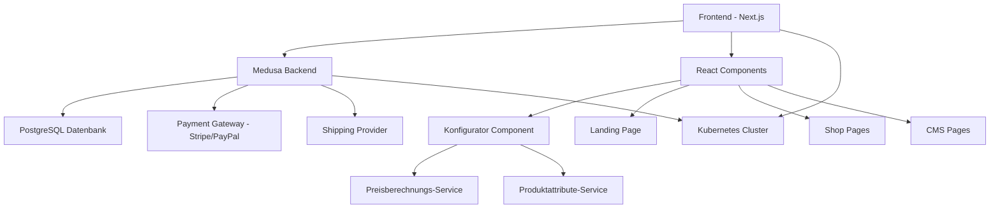
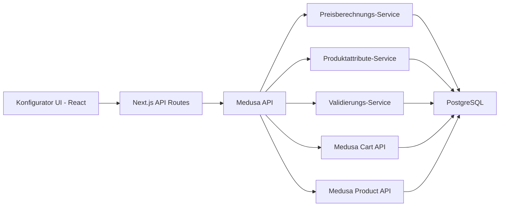
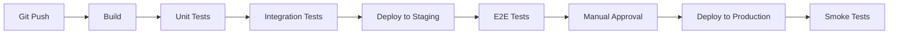

# Fliegengitter-Shop Master Plan
## Next.js + Medusa E-Commerce Lösung

**Projekt:** Die Fliegengitter Profis - Maßgefertigte Insektenschutzgitter  
**Basis:** Next.js 15 + Medusa.js + Kubernetes  
**Referenz-Website:** https://www.diefliegengitterprofis.de/  
**Erstellt:** 25. Januar 2026  
**Aktualisiert:** 4. Februar 2026 (Stack-Wechsel zu Next.js + Medusa)

---

## 📋 Executive Summary

Entwicklung eines vollständigen E-Commerce-Shops für maßgefertigte Fliegengitter basierend auf Next.js 15 und Medusa.js. Das Projekt umfasst:

1. **Next.js Frontend** - Responsive React-Anwendung mit TypeScript und Tailwind CSS
2. **Landing Page** - Marketing-optimierte Startseite mit Conversion-Fokus
3. **Konfigurator-Komponente** - Dynamische Preisberechnung basierend auf Maßen und Attributen
4. **CMS-Seiten** - Informationsseiten für Produkte und Services
5. **Medusa Backend** - Vollständige E-Commerce-Funktionalität mit REST/GraphQL API
6. **Kubernetes Deployment** - Skalierbare Cloud-Infrastruktur

---

## 🎯 Projektziele

### Hauptziele
- ✅ Bereitstellung eines funktionsfähigen Online-Shops für maßgefertigte Fliegengitter
- ✅ Intuitive Produktkonfiguration mit Echtzeit-Preisberechnung
- ✅ Responsive Design für alle Geräte (Mobile-First)
- ✅ Moderne Headless-Commerce-Architektur mit Next.js + Medusa
- ✅ Skalierbare und wartbare Microservices-Architektur
- ✅ Kubernetes-basiertes Deployment

### Geschäftsziele
- Automatisierung der Angebotserstellung
- Reduzierung manueller Preiskalkulationen
- Verbesserung der Customer Experience
- Erhöhung der Conversion-Rate
- Erweiterung des Online-Geschäfts

---

## 🏗️ Projektphasen

### Phase 1: Analyse & Planung ⏳ (Aktuell)
**Dauer:** 1 Woche

#### Aufgaben:
- [x] Analyse der Referenz-Website
- [x] Dokumentation der Anforderungen
- [ ] Erstellung detaillierter Spezifikationen
- [ ] Technische Architektur-Planung
- [ ] Datenbank-Schema-Design
- [ ] UI/UX Wireframes

#### Deliverables:
- Anforderungsdokument
- Technische Spezifikation
- Datenbank-Schema
- Wireframes & Mockups
- Projektplan mit Meilensteinen

---

### Phase 2: Entwicklungsumgebung Setup ✅ (Abgeschlossen)
**Status:** Bereits eingerichtet

#### Komponenten:
- ✅ Next.js 15 Projekt mit TypeScript
- ✅ Tailwind CSS Integration
- ✅ Docker-Konfiguration (Multi-Stage Build)
- ✅ Kubernetes Manifests (Deployment, Service, Ingress)
- ✅ PostgreSQL-Datenbank (für Medusa)
- ✅ Git-Repository-Struktur
- ✅ Deployment-Script (deploy-to-k8s.ps1)
- ✅ Vollständige Dokumentation

---

### Phase 3: Frontend-Entwicklung (Next.js) 📋
**Dauer:** 2-3 Wochen

#### 3.1 Komponenten-Grundstruktur
- [ ] React-Komponenten-Bibliothek aufbauen
- [ ] Layout-Komponenten (Header, Footer, Navigation)
- [ ] Tailwind CSS Custom Theme (Orange/Anthrazit)
- [ ] Responsive Grid-System
- [ ] Typografie & Farbschema

#### 3.2 UI-Komponenten
- [ ] Header mit Logo und Navigation (React Component)
- [ ] Hero-Section für Landing Page
- [ ] Produkt-Karten-Design (Card Components)
- [ ] Call-to-Action Buttons (Button Components)
- [ ] Footer mit Kontaktinformationen
- [ ] Mobile Navigation (Responsive Menu)
- [ ] Loading States & Skeletons

#### 3.3 Next.js Pages (App Router)
- [ ] Homepage (app/page.tsx)
- [ ] Produktlisten-Seite (app/produkte/page.tsx)
- [ ] Produktdetail-Seite (app/produkte/[id]/page.tsx)
- [ ] Warenkorb-Seite (app/warenkorb/page.tsx)
- [ ] Checkout-Flow (app/checkout/page.tsx)
- [ ] CMS-Seiten (app/[slug]/page.tsx)

#### 3.4 Branding & Design
- [ ] Logo-Integration
- [ ] Farbpalette (Orange/Grau basierend auf Referenz)
- [ ] Bildoptimierung
- [ ] Icon-Set
- [ ] Custom Fonts

#### Deliverables:
- Vollständiges Theme-Package
- Style Guide
- Komponenten-Bibliothek
- Responsive Design für alle Breakpoints

---

### Phase 4: Landing Page Entwicklung 📋
**Dauer:** 1 Woche

#### 4.1 Hero-Section
- [ ] Hauptbild mit Fliegengitter-Motiv
- [ ] Überschrift: "Endlich Schluss mit lästigen Insekten"
- [ ] Call-to-Action Buttons ("Jetzt anfragen", "Mehr Informationen")
- [ ] Trust-Elemente (Bewertungen, z.B. "Über 175 Bewertungen")

#### 4.2 Produkt-Übersicht
- [ ] "Premium Insektenschutzgitter" Section
- [ ] Produktbilder und Beschreibungen
- [ ] Feature-Highlights (Aluminium, Magnethalterung, etc.)

#### 4.3 Leistungen-Section
- [ ] "Fliegengitter nach Maß" - Individuelle Anpassung
- [ ] "Große Farbauswahl" - Farboptionen und Lackierungen
- [ ] Icon-basierte Darstellung

#### 4.4 Weitere Sections
- [ ] Vorteile-Section (USPs)
- [ ] Installations-Optionen (Klick-System, Schraubmontage)
- [ ] Kontakt-Formular
- [ ] Testimonials/Bewertungen

#### Deliverables:
- Vollständige Landing Page
- Optimierte Bilder
- SEO-optimierte Inhalte
- Mobile-optimierte Version

---

### Phase 5: Konfigurator-Entwicklung 📋
**Dauer:** 3-4 Wochen

#### 5.1 Konfigurator-Komponente
- [ ] React-Komponente erstellen (components/konfigurator/)
- [ ] State Management (React Context oder Zustand)
- [ ] TypeScript Interfaces für Konfiguration
- [ ] Medusa Custom Endpoints für Preisberechnung

#### 5.2 Datenmodell
- [ ] Produktattribute definieren:
  - Breite (mm)
  - Höhe (mm)
  - Farbe (RAL-Farben)
  - Gewebeart (Standard-Polenfilter, Katzennetz, etc.)
  - Montage-Art (Klick-System, Schraubmontage)
  - Rahmentyp
- [ ] Preisregeln-Tabelle
- [ ] Materialkosten-Tabelle
- [ ] Aufschläge-Tabelle

#### 5.3 Preisberechnungs-Engine
- [ ] Basis-Preisberechnung (Fläche = Breite × Höhe)
- [ ] Material-Aufschläge
- [ ] Farb-Aufschläge
- [ ] Gewebeart-Aufschläge
- [ ] Montage-Aufschläge
- [ ] Mindestpreis-Logik
- [ ] Mengenrabatte

**Beispiel-Formel:**
```
Grundpreis = (Breite × Höhe) × Basis-Preis-pro-qm
+ Material-Aufschlag
+ Farb-Aufschlag
+ Gewebeart-Aufschlag
+ Montage-Aufschlag
= Endpreis
```

#### 5.4 Konfigurator-UI
- [ ] Maßeingabe-Formular (Breite/Höhe)
- [ ] Farb-Auswahl (Dropdown/Farbpalette)
- [ ] Gewebeart-Auswahl (Radio Buttons/Dropdown)
- [ ] Montage-Auswahl
- [ ] Live-Preisanzeige
- [ ] Visualisierung (optional)
- [ ] "In den Warenkorb"-Integration

#### 5.5 Admin-Funktionen
- [ ] Preisregel-Verwaltung
- [ ] Material-Verwaltung
- [ ] Farb-Verwaltung
- [ ] Aufschlags-Verwaltung
- [ ] Berechnungs-Logs
- [ ] Export/Import-Funktionen

#### 5.6 Integration
- [ ] Medusa Product-Varianten Integration
- [ ] Warenkorb-Integration (Medusa Cart API)
- [ ] Checkout-Integration (Medusa Checkout Flow)
- [ ] Preis-Caching (React Query oder SWR)
- [ ] REST API-Endpunkte (Next.js API Routes + Medusa)

#### Deliverables:
- Vollständige Konfigurator-Komponente
- Medusa Custom Endpoints
- API-Dokumentation
- Unit Tests (Jest + React Testing Library)
- Integration Tests (Playwright)

---

### Phase 6: CMS-Seiten & Content 📋
**Dauer:** 1 Woche

#### 6.1 Informationsseiten
- [ ] Über uns
- [ ] Produkte & Leistungen
- [ ] Montage-Anleitungen
- [ ] FAQ
- [ ] Kontakt
- [ ] Impressum
- [ ] Datenschutz
- [ ] AGB

#### 6.2 Produkt-Content
- [ ] Produktbeschreibungen
- [ ] Technische Daten
- [ ] Pflegehinweise
- [ ] Garantie-Informationen

#### 6.3 SEO-Optimierung
- [ ] Meta-Tags
- [ ] Strukturierte Daten (Schema.org)
- [ ] XML-Sitemap
- [ ] Robots.txt

#### Deliverables:
- Vollständige CMS-Seiten
- SEO-optimierte Inhalte
- Bilder und Medien

---

### Phase 7: E-Commerce Integration 📋
**Dauer:** 2 Wochen

#### 7.1 Produktkatalog
- [ ] Produktkategorien erstellen
- [ ] Produkte anlegen
- [ ] Produktattribute konfigurieren
- [ ] Produktbilder hochladen
- [ ] Produktvarianten definieren

#### 7.2 Warenkorb & Checkout
- [ ] Warenkorb-Anpassungen
- [ ] Checkout-Flow-Optimierung
- [ ] Versandkosten-Berechnung
- [ ] Zahlungsmethoden-Integration
- [ ] Bestellbestätigungs-E-Mails

#### 7.3 Zahlungsintegration
- [ ] PayPal-Integration
- [ ] Kreditkarten-Gateway
- [ ] Rechnung/Vorkasse
- [ ] SEPA-Lastschrift (optional)

#### 7.4 Versandintegration
- [ ] Versandkosten-Regeln
- [ ] Versandarten definieren
- [ ] Tracking-Integration (optional)

#### Deliverables:
- Funktionsfähiger Shop
- Zahlungsintegration
- Versandkonfiguration
- E-Mail-Templates

---

### Phase 8: Testing & QA 📋
**Dauer:** 1-2 Wochen

#### 8.1 Funktionale Tests
- [ ] Konfigurator-Tests (alle Kombinationen)
- [ ] Preisberechnungs-Tests
- [ ] Warenkorb-Tests
- [ ] Checkout-Tests
- [ ] Zahlungs-Tests (Sandbox)

#### 8.2 UI/UX Tests
- [ ] Responsive Design Tests (alle Geräte)
- [ ] Browser-Kompatibilität (Chrome, Firefox, Safari, Edge)
- [ ] Accessibility Tests (WCAG)
- [ ] Performance Tests

#### 8.3 Sicherheitstests
- [ ] SQL-Injection Tests
- [ ] XSS-Tests
- [ ] CSRF-Tests
- [ ] Authentifizierung/Autorisierung

#### 8.4 Performance-Optimierung
- [ ] Ladezeiten-Optimierung
- [ ] Bild-Optimierung
- [ ] Caching-Strategie
- [ ] Database-Query-Optimierung

#### Deliverables:
- Test-Protokolle
- Bug-Reports
- Performance-Berichte
- Optimierungsempfehlungen

---

### Phase 9: Deployment & Go-Live 📋
**Dauer:** 1 Woche

#### 9.1 Produktionsumgebung
- [ ] Server-Setup
- [ ] SSL-Zertifikat
- [ ] Domain-Konfiguration
- [ ] Datenbank-Migration
- [ ] Backup-Strategie

#### 9.2 Deployment
- [ ] Code-Deployment
- [ ] Datenbank-Migration
- [ ] Konfiguration
- [ ] Smoke Tests

#### 9.3 Go-Live
- [ ] DNS-Umstellung
- [ ] Monitoring-Setup
- [ ] Fehlerüberwachung
- [ ] Performance-Monitoring

#### 9.4 Dokumentation
- [ ] Admin-Handbuch
- [ ] Benutzer-Handbuch
- [ ] Wartungs-Dokumentation
- [ ] Troubleshooting-Guide

#### Deliverables:
- Live-Shop
- Vollständige Dokumentation
- Backup-Strategie
- Monitoring-Setup

---

### Phase 10: Wartung & Support 📋
**Laufend**

#### 10.1 Laufende Wartung
- [ ] Sicherheitsupdates
- [ ] Bug-Fixes
- [ ] Performance-Monitoring
- [ ] Backup-Überwachung

#### 10.2 Feature-Erweiterungen
- [ ] Neue Produkttypen
- [ ] Zusätzliche Konfigurationsoptionen
- [ ] Marketing-Features
- [ ] Analytics-Integration

#### 10.3 Support
- [ ] Technischer Support
- [ ] Schulungen
- [ ] Dokumentations-Updates

---

## 🛠️ Technische Architektur

### System-Komponenten



### Komponenten-Architektur



### Datenbank-Schema

#### Tabelle: `FliegengitterConfiguration`
```sql
CREATE TABLE FliegengitterConfiguration (
    Id INT PRIMARY KEY,
    ProductId INT,
    Width DECIMAL(10,2),
    Height DECIMAL(10,2),
    ColorId INT,
    MeshTypeId INT,
    MountingTypeId INT,
    CalculatedPrice DECIMAL(18,2),
    CreatedOnUtc DATETIME,
    FOREIGN KEY (ProductId) REFERENCES Product(Id)
);
```

#### Tabelle: `PriceRule`
```sql
CREATE TABLE PriceRule (
    Id INT PRIMARY KEY,
    Name NVARCHAR(255),
    RuleType NVARCHAR(50), -- 'BasePricePerSqm', 'ColorSurcharge', etc.
    Value DECIMAL(18,2),
    IsActive BIT,
    Priority INT
);
```

#### Tabelle: `MaterialOption`
```sql
CREATE TABLE MaterialOption (
    Id INT PRIMARY KEY,
    Name NVARCHAR(255),
    Type NVARCHAR(50), -- 'Color', 'MeshType', 'MountingType'
    Surcharge DECIMAL(18,2),
    DisplayOrder INT,
    IsActive BIT
);
```

---

## 💰 Preisberechnungs-Logik

### Basis-Formel

```typescript
export function calculatePrice(config: ConfigurationModel): number {
    // 1. Fläche berechnen
    const area = (config.width / 1000) * (config.height / 1000); // in m²
    
    // 2. Grundpreis
    const basePrice = area * getBasePricePerSqm();
    
    // 3. Aufschläge
    const colorSurcharge = getColorSurcharge(config.colorId);
    const meshSurcharge = getMeshTypeSurcharge(config.meshTypeId);
    const mountingSurcharge = getMountingTypeSurcharge(config.mountingTypeId);
    
    // 4. Gesamtpreis
    let totalPrice = basePrice + colorSurcharge + meshSurcharge + mountingSurcharge;
    
    // 5. Mindestpreis prüfen
    const minimumPrice = getMinimumPrice();
    if (totalPrice < minimumPrice) {
        totalPrice = minimumPrice;
    }
    
    // 6. Runden
    return Math.round(totalPrice * 100) / 100;
}
```

### Beispiel-Kalkulation

**Eingabe:**
- Breite: 1200 mm
- Höhe: 1500 mm
- Farbe: Anthrazit (RAL 7016)
- Gewebeart: Standard-Polenfilter
- Montage: Klick-System

**Berechnung:**
```
Fläche = 1.2m × 1.5m = 1.8 m²
Grundpreis = 1.8 m² × 45 €/m² = 81.00 €
Farb-Aufschlag (Anthrazit) = 15.00 €
Gewebeart-Aufschlag (Standard) = 0.00 €
Montage-Aufschlag (Klick) = 10.00 €
─────────────────────────────────────
Gesamtpreis = 106.00 €
```

---

## 🎨 Design-Spezifikationen

### Farbpalette (basierend auf Referenz-Website)

```css
:root {
    /* Primärfarben */
    --primary-orange: #FF8C42;
    --primary-dark: #2C2C2C;
    --primary-light: #F5F5F5;
    
    /* Sekundärfarben */
    --secondary-gray: #6B6B6B;
    --secondary-light-gray: #E0E0E0;
    
    /* Akzentfarben */
    --accent-green: #4CAF50; /* für Success */
    --accent-red: #F44336; /* für Errors */
    
    /* Text */
    --text-primary: #2C2C2C;
    --text-secondary: #6B6B6B;
    --text-light: #FFFFFF;
}
```

### Typografie

```css
/* Überschriften */
h1 { font-size: 2.5rem; font-weight: 700; }
h2 { font-size: 2rem; font-weight: 600; }
h3 { font-size: 1.5rem; font-weight: 600; }

/* Body */
body { 
    font-family: 'Open Sans', 'Helvetica Neue', Arial, sans-serif;
    font-size: 16px;
    line-height: 1.6;
}

/* Buttons */
.btn-primary {
    background: var(--primary-orange);
    color: white;
    padding: 12px 24px;
    border-radius: 4px;
}
```

### Responsive Breakpoints

```css
/* Mobile First */
@media (min-width: 576px) { /* Small devices */ }
@media (min-width: 768px) { /* Tablets */ }
@media (min-width: 992px) { /* Desktops */ }
@media (min-width: 1200px) { /* Large desktops */ }
```

---

## 📊 Produkttypen & Konfigurationsoptionen

### Produktkategorien

1. **Fliegengitter für Fenster**
   - Drehrahmen
   - Spannrahmen
   - Rollo
   - Plissee

2. **Fliegengitter für Türen**
   - Drehtür
   - Pendeltür
   - Schiebetür
   - Plisseetür

3. **Lichtschachtabdeckungen**

4. **Sonderanfertigungen**

### Konfigurationsoptionen

#### 1. Maße
- **Breite:** 100 - 3000 mm (Eingabefeld)
- **Höhe:** 100 - 3000 mm (Eingabefeld)
- **Validierung:** Min/Max-Werte, Plausibilitätsprüfung

#### 2. Farben (RAL-Farben)
- Weiß (RAL 9016)
- Anthrazit (RAL 7016)
- Braun (RAL 8014)
- Silber
- Weitere RAL-Farben auf Anfrage

#### 3. Gewebeart
- **Standard-Polenfilter** (0,00 € Aufschlag)
  - Maschenweite: 1,2 × 1,2 mm
  - Für normale Insekten
  
- **Katzennetz** (+15,00 €)
  - Verstärkt, kratzfest
  - Für Haushalte mit Haustieren
  
- **Pollenschutzgewebe** (+20,00 €)
  - Feinmaschig
  - Für Allergiker
  
- **Edelstahlgewebe** (+35,00 €)
  - Rostfrei, langlebig
  - Premium-Option

#### 4. Montage-Art
- **Klick-System** (+10,00 €)
  - Werkzeuglose Montage
  - Einfache Handhabung
  
- **Schraubmontage** (+0,00 €)
  - Klassische Befestigung
  - Sehr stabil
  
- **Einhängesystem** (+15,00 €)
  - Für Rollläden
  - Spezielle Halterungen

#### 5. Rahmentyp
- Aluminium-Rahmen (Standard)
- Kunststoff-Rahmen
- Holz-Rahmen (auf Anfrage)

---

## 🔌 API-Endpunkte

### Konfigurator-API

```typescript
// POST: /api/konfigurator/calculate-price
export async function POST(request: Request) {
    const { width, height, colorId, meshTypeId, mountingTypeId } = await request.json();
    
    const price = calculatePrice({
        width,
        height,
        colorId,
        meshTypeId,
        mountingTypeId
    });
    
    return Response.json({ 
        price,
        formattedPrice: formatPrice(price)
    });
}

// GET: /api/konfigurator/options
export async function GET() {
    const medusa = getMedusaClient();
    
    return Response.json({
        colors: await medusa.getColors(),
        meshTypes: await medusa.getMeshTypes(),
        mountingTypes: await medusa.getMountingTypes()
    });
}

// POST: /api/warenkorb/add
export async function POST(request: Request) {
    const config = await request.json();
    const medusa = getMedusaClient();
    
    const cartItem = await medusa.carts.lineItems.create(config.cartId, {
        variant_id: config.variantId,
        quantity: 1,
        metadata: config
    });
    
    return Response.json({ success: true, cartItem });
}
```

---

## 📱 Mobile-First Ansatz

### Prioritäten für Mobile

1. **Einfache Navigation**
   - Hamburger-Menü
   - Sticky Header
   - Große Touch-Targets (min. 44×44px)

2. **Optimierte Formulare**
   - Numerische Tastatur für Maßeingaben
   - Große Eingabefelder
   - Inline-Validierung

3. **Performance**
   - Lazy Loading für Bilder
   - Minimiertes CSS/JS
   - Service Worker für Offline-Funktionalität

4. **Konfigurator-UI**
   - Schritt-für-Schritt-Wizard
   - Visuelle Feedback
   - Fortschrittsanzeige

---

## 🔒 Sicherheit & Compliance

### Sicherheitsmaßnahmen

- [ ] HTTPS/SSL-Verschlüsselung
- [ ] CSRF-Protection
- [ ] XSS-Prevention
- [ ] SQL-Injection-Prevention
- [ ] Input-Validierung
- [ ] Output-Encoding
- [ ] Sichere Passwort-Speicherung
- [ ] Rate Limiting
- [ ] Security Headers

### DSGVO-Compliance

- [ ] Cookie-Banner
- [ ] Datenschutzerklärung
- [ ] Einwilligungsverwaltung
- [ ] Recht auf Löschung
- [ ] Datenexport-Funktion
- [ ] Verschlüsselte Datenübertragung
- [ ] Datensparsamkeit

---

## 📈 Performance-Ziele

### Metriken

- **Ladezeit (First Contentful Paint):** < 1.5s
- **Time to Interactive:** < 3.5s
- **Lighthouse Score:** > 90
- **Core Web Vitals:**
  - LCP (Largest Contentful Paint): < 2.5s
  - FID (First Input Delay): < 100ms
  - CLS (Cumulative Layout Shift): < 0.1

### Optimierungsstrategien

- Bild-Optimierung (WebP, Lazy Loading)
- CSS/JS Minification
- Gzip/Brotli Compression
- Browser-Caching
- CDN-Integration
- Database Query Optimization
- Redis-Caching für Preisberechnungen

---

## 🧪 Testing-Strategie

### Unit Tests
- Preisberechnungs-Logik
- Validierungs-Services
- Business-Logic-Services

### Integration Tests
- Plugin-Integration mit nopCommerce
- Warenkorb-Integration
- Checkout-Flow

### E2E Tests
- Kompletter Bestellprozess
- Konfigurator-Workflow
- Zahlungsabwicklung

### Performance Tests
- Load Testing (100+ gleichzeitige Benutzer)
- Stress Testing
- Spike Testing

---

## 📚 Dokumentation

### Entwickler-Dokumentation
- [ ] Architektur-Übersicht
- [ ] API-Dokumentation
- [ ] Plugin-Entwicklungs-Guide
- [ ] Theme-Entwicklungs-Guide
- [ ] Datenbank-Schema
- [ ] Deployment-Guide

### Benutzer-Dokumentation
- [ ] Admin-Handbuch
- [ ] Konfigurator-Anleitung
- [ ] Produktverwaltung
- [ ] Bestellverwaltung
- [ ] FAQ

### Wartungs-Dokumentation
- [ ] Backup-Prozeduren
- [ ] Update-Prozeduren
- [ ] Troubleshooting-Guide
- [ ] Monitoring-Setup

---

## 🚀 Deployment-Strategie

### Umgebungen

1. **Development** (Lokal/Docker)
   - Entwicklung und Testing
   - Hot Reload aktiviert
   - Debug-Modus

2. **Staging** (Server)
   - Pre-Production Testing
   - Produktions-ähnliche Konfiguration
   - QA und Abnahme

3. **Production** (Live-Server)
   - Live-Shop
   - Optimierte Performance
   - Monitoring aktiv

### CI/CD Pipeline



---

## 🎓 Schulung & Wissenstransfer

### Admin-Schulung
- [ ] nopCommerce-Grundlagen
- [ ] Produktverwaltung
- [ ] Bestellverwaltung
- [ ] Konfigurator-Konfiguration
- [ ] Preisregel-Verwaltung

### Entwickler-Schulung
- [ ] nopCommerce-Architektur
- [ ] Plugin-Entwicklung
- [ ] Theme-Entwicklung
- [ ] Deployment-Prozesse

---

## 📞 Support & Wartung

### Support-Levels

**Level 1: Basis-Support**
- Bug-Fixes
- Sicherheitsupdates
- Technischer Support (E-Mail)

**Level 2: Erweitert**
- Feature-Erweiterungen
- Performance-Optimierung
- Telefon-Support

**Level 3: Premium**
- 24/7 Support
- Dedizierter Ansprechpartner
- Proaktives Monitoring

---

## 📊 Erfolgsmessung (KPIs)

### Technische KPIs
- Uptime: > 99.9%
- Ladezeit: < 2s
- Fehlerrate: < 0.1%
- API-Response-Zeit: < 200ms

### Business KPIs
- Conversion-Rate
- Durchschnittlicher Bestellwert
- Warenkorbabbruchrate
- Kundenzufriedenheit

---

## 🔄 Nächste Schritte

### Sofort
1. ✅ Analyse der Referenz-Website abgeschlossen
2. ✅ Master-Plan erstellt
3. [ ] Detaillierte Spezifikationen für Plugin erstellen
4. [ ] Wireframes für Konfigurator-UI erstellen
5. [ ] Datenbank-Schema finalisieren

### Diese Woche
- [ ] Theme-Struktur aufsetzen
- [ ] Plugin-Grundgerüst erstellen
- [ ] Erste Prototypen entwickeln

### Nächste Woche
- [ ] Landing Page implementieren
- [ ] Basis-Konfigurator entwickeln
- [ ] Erste Tests durchführen

---

## 📝 Offene Fragen

1. **Zahlungsanbieter:** Welche Payment-Gateways sollen integriert werden?
2. **Versanddienstleister:** Welche Versandoptionen sind gewünscht?
3. **Hosting:** Wo soll der Shop gehostet werden?
4. **Domain:** Welche Domain soll verwendet werden?
5. **E-Mail-Provider:** Welcher E-Mail-Service für Transaktions-E-Mails?
6. **Analytics:** Google Analytics, Matomo oder andere?
7. **Marketing:** Newsletter-Integration gewünscht?
8. **ERP-Integration:** Soll eine Anbindung an ein ERP-System erfolgen?

---

## 🎯 Zusammenfassung

Dieses Projekt umfasst die vollständige Entwicklung eines E-Commerce-Shops für maßgefertigte Fliegengitter. Die Hauptkomponenten sind:

1. **Custom Theme** - Responsive, markenkonformes Design
2. **Landing Page** - Conversion-optimierte Startseite
3. **Konfigurator-Plugin** - Intelligente Preisberechnung
4. **Shop-Integration** - Vollständige E-Commerce-Funktionalität

Die Entwicklung erfolgt in 10 Phasen über einen Zeitraum von ca. 10-12 Wochen. Das Projekt basiert auf nopCommerce 4.90.3 und nutzt moderne Web-Technologien für eine optimale Performance und Benutzererfahrung.

---

**Status:** 🟡 In Planung  
**Nächster Meilenstein:** Detaillierte Spezifikationen & Wireframes  
**Verantwortlich:** Entwicklungsteam  
**Review-Datum:** TBD
